


# Instructions

- [ ] Encourage engagement and interaction
- [x] Keep all blog entries as leaf bundles (for example, `hugo new content tech/blog-entry-name` with no .md creates a leaf bundle in the tech section)
- [x] Create a banner image (post-cover.png) in your leaf bundle that has a ratio of 1.85:1, and is no smaller than: 962x520 pixels (Ideally 1536x830 or greater)
- [x] Still manually add banner image into page content, first thing before anything else using the banner shortcode
- [x] Add any other images you use to the images front matter array (this is purely to help with OpenGraph generation)
- [ ] You can use up to two more images in the blog entry, but try not to use any more (unless this is a listicle). Only the banner is essential
- [ ] Try to write 1000 words. The closer to this number, the better, but don't go over (75% of the public prefers reading articles under 1,000 words)
- [ ] Reading time should not exceed seven minutes
- [x] Make sure to include a description and summary for the blog entry as these are used on the site and in SEO
- [x] Make an appropriate choice of tags in the front matter. These will help in recommending pages to the reader
- [x] Make an appropriate choice of categories in the front matter. The first category will be used in the breadcrumb for the page, others will generate the side menu
- [x] Use Emacs to generate the reading ease and grade level (this should happen automatically when saving the file in my Emacs configuration). These are just for fun, incidentally, and appear to have no impact on audience engagement
- [x] Set the draft to false when you want to publish, then push to GitHub
- [ ] Drop a video announcing this post on Instagram etc, and post anywhere else you can as well. Reels and videos work better for engagement
- [ ] Consider what tomorrow's article will be, and try to post a new one once a day (more is fine)


I believe this is the first time that I've publicly written about typewriters. Loose acquaintances might be surprised at my interest in them, given that I have a [strong computing background](https://theses.gla.ac.uk/2760/) (including designing my own [writing software](https://github.com/sympodius/org-novelist)). However, I am a great believer in building things that will last, and I have a particular fondness for analogue creation methods. I also believe strongly in buying and maintaining well built things, rather than regularly replacing poorly made ones.

Recently, I decided to gift a typewriter to a talented author friend of mine. In order to make it as useful as possible, I wanted it to be a portable manual typewriter (so that it could be used anywhere and without power), and for it to look and work like new. Since the production of high quality manual typewriters ended decades ago, this was no small task.

My research showed that there had been two typewriter factories near where I'd grown up: Olivetti and Remington. The Olivetti one was much closer to my childhood home (6 km as opposed to 19 km) and I felt that might make the gift more meaningful. Olivetti had plants all over the world, many producing the same models, but the most iconic typewriter to be produced (non-exclusively) at the [Olivetti Glasgow plant](https://oztypewriter.blogspot.com/2015/05/inside-olivetti-typewriter-factory.html) was most certainly the [Lettera 22](https://en.wikipedia.org/wiki/Olivetti_Lettera_22).

Of course, the first thing I tried was finding a Glasgow-made Olivetti Lettera 22 that was already in excellent condition and required no work whatsoever. But fate is rarely so generous. I also specifically wanted one with the leather strapped carrying bag, and a tabulator function. The only machine being sold at the time that satisfied all these conditions was priced at £250. I felt that was a little steep, given that it still needed some restoration work. The only other typewriter available at the time that satisfied all my conditions was priced at £34.

I hear you shouting with joy, "My goodness, John, what an excellent deal!" But you would be premature in your excitement. The typewriter was not a steal. If anything, I felt it was still massively overvalued. The aesthetic condition of the typewriter was not good. The bag and machine were filthy and covered in who knows what. Additionally, the typewriter was non-operational, and the bag had ripped zippers and degrading leather. However, there were no apparent rips in the main bag textile, and no major dents or bashes in the typewriter shell. Also, the keys all seemed to be intact without severe scratches or cracks or broken pieces. I was making the rather bold assumption that I could probably fix anything else if these things were fine. And, ultimately, I didn't have time to wait around for something better to come along, so I took the gamble.

Ordering second-hand typewriters online is fraught with peril. Especially when the seller simply states "non-functioning" and doesn't include many photos. To be fair, it was very well packaged, and I was certain it hadn't gotten any worse in transit, but I was disappointed to find that there were two tears in the rear of the carrying bag. Still, it really was the only option, so I'd have to make the best of it.

So, to summarise: we have a Glasgow-made, metal-cased Olivetti Lettera 22 in the taupe colour with rounded black keys. It is capable of using two-coloured ink ribbons (and mimeograph stencilling), includes full tab functionality, and comes in a brown carrying case with leather trimming. Of course, it doesn't actually work at all, it's filthy and covered in... something, and the carrying case is disintegrating and falling apart; but the bones are there. I tried to identify the typeface by looking at the type slugs. It might have been *Olivetti Distinctive Elite*, but I really wasn't sure. I tried to gauge its manufacturing date by comparing its serial number to those in the [typewriter database](https://typewriterdatabase.com), and estimated that it was probably from 1957. At the time of manufacture, it was likely sold for about £12-10s-0d (which would be about £30 in new money). Adjusted for inflation, that would be about £800 in 2025.

I should point out that I had not intended to write a tutorial on the restoration of this machine. As such, I have not taken photos of every stage of the process. But after posting some before-and-after photos online (and receiving several requests to explain what I'd done), I've decided to do my best and describe the process. However, this is merely an account of what I did. I take no responsibility for your safety or the safety of your typewriter if you attempt to replicate anything I've done.

## Assessment Of Required Work
Once I started properly assessing the typewriter, I could see there was a lot to be tackled:

- Main spring loose inside housing
- Drawband frayed and likely to snap
- Carriage release always on
- Brake pad missing
- Case loose and wobbly
- Paint scratches exposing some metal (potential rust risk)
- Bodywork dirty
- Feet worn down and not grippy
- Interior of machine was gross
- Carriage lock mechanism not functional
- Missing ribbon spool screw
- Some letters misaligned to the point of being distracting
- Musty smell

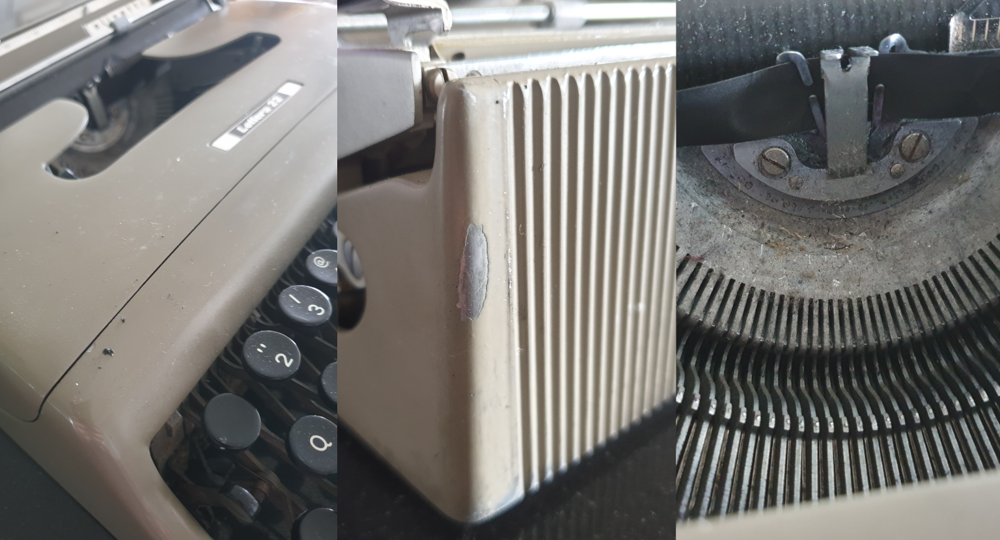

The carrying case also had a lot of work needing done:

- Case covered in dirt, paint, and other gunk
- Black flecks inside (probably degraded rubber)
- Internal foot pad coming off
- Zipper disintegrated
- Leather zipper crossover covers disintegrating
- Leather flip latch coming off and rotting, with stitches missing in most parts
- Tears on case 'hinge'
- Leather on handles deteriorating and coming loose
- Musty smell

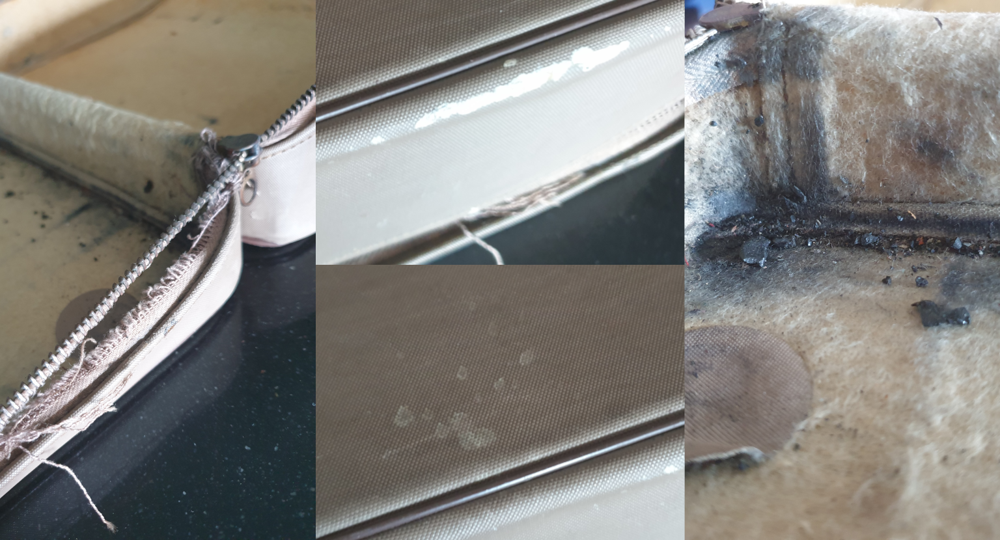

There were some supplies I'd need to tackle all that, so I ordered the following things immediately:

- 0.5 mm mono-filament clear nylon fishing line (to replace draw band)---£3.32
- Set of neoprene rubber grommets, 4 mm ID x 9 mm OD x 5 mm tall (to fix wobbly case)---£5.82
- Nail polish in various colours + clear (to cover exposed metal on bodywork)---£12.95
- Set of four new third-party produced feet from eBay (to replace degraded ones)---£8.99
- Set of two ribbon spool screws from eBay (to replace missing one)---£8.99
- Two beige YKK 81 cm zips with brass metal fixings (to replace rotted zippers)---£17.30
- Light coffee 0.8 mm flat waxed polyester thread (for leather work)---£7.29
- Oxblood coloured full grain oil tanned cowhide leather, 30 cm x 60 cm (for replacing leather handle covers)---£39.99
- Gütermann beige bone (0722) 100% polyester sewing thread (for attaching new zips)---£12.32

That came to a total of £116.97. Admittedly, I'd had to overbuy on some things because I couldn't order in smaller quantities, but that's still a big cost. There were other things that I needed as well, but I already had them from other projects:

- Cillit Bang multi purpose cleaner spray (for cleaning without using bleach)---£2.95
- Microfiber cloths (for cleaning)---£9.49
- Renaissance micro-crystalline wax polish (for protection and shine)---£10.95
- MG Chemicals rubber renue (for cleaning and lightly softening platen)---£9.82
- UHU textile solvent free fabric glue (for fixing tears and reattaching carrying case lining)---£4.10
- White spirit, 2 litres (for cleaning internal metal parts)---£11
- Set of 12 mini soft brass wire brushes (for cleaning internal metal parts)---£5.29
- Dust blower (for blowing out internal nastiness)---£39.99
- Leather burnishing tools (for burnishing handle leather)---£24.49
- Leather edge beveler (for bevelling the edges of handle leather)---£6.99
- Seiwa Leather Craft tokonole burnishing gum (for burnishing handle leather)---£10.26
- Preservation Solutions restoration leather conditioner (for polishing and protecting leather)---£13.50
- Klucel G powder + isopropyl alcohol (for stabilising rotting leather)---£30
- 4.5 mm thin spanner (to remove platen)---£4
- Swiss Army Knife scissor spring (to replace carriage release spring)---£3
- Metal file (to shape replacement carriage release spring)---£10
- Champagne cork (to replace brake pad)---£0.10
- Dryer sheets (to get rid of musty smell)---£1
- Sewing needles (for cleaning paint and gunk off case, and for sewing zippers and handles)---£10
- Spark plug terminal pliers (the rubber ends make them good for manipulating type bars without damaging them)---£10

Which is another £216.93. While I already had all the stuff on the second list, if you had to buy everything yourself, the total material cost for repairs would be £333.90.

The sharp-eyed among you might have spotted that I'd now spent significantly more on supplies than I'd spent on the original typewriter (even ignoring the stuff I already had). Heck, just the leather alone cost more. Such is the way of things.

While it might now appear that the £250 typewriter was actually a pretty good deal, it still didn't look anything close to how nice this one came out when I was done with it (and I doubt it worked as well either). I'd still have needed to buy quite a lot of these supplies to get that one to the same standard, so it would still have been much more expensive in the end.

## Fixing The Machine
My goal in restoring the typewriter was to keep as much of the original stuff as possible, and only replace what couldn't be repaired.

The first thing to do was get the shell off the typewriter, take the carriage off, and dismantle the carriage and main spring. I also took the ribbon off and set it aside. I'd be replacing it with a new one, but it's always good to keep known working spools handy until the changeover is successful. Also, if you're lucky enough to have original spools on your typewriter, always keep them or sell them to a collector---never throw them away.

I'm not going to be going into great detail on how I took things apart, as there are already videos online showing how to do this. Here are some that I found useful:

- [Removing the shell and carriage](https://www.youtube.com/watch?v=Z5CcZqSgTNA)
- [Removing the platen](https://www.youtube.com/watch?v=b_prbykGLtg)
- [Reassembling the carriage](https://www.youtube.com/watch?v=_dG12u9yo6U)
- [Reassembling the shell and carriage](https://www.youtube.com/watch?v=cHSZXKlYjBo)

In the process of taking off the shell, I discovered the missing ribbon spool screw. While I was pleased to have the original part, I was annoyed that I'd spent money on replacements. At least my friend would have spares now.

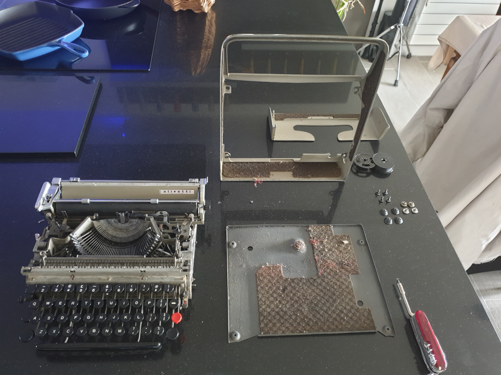

### Cleaning The Machine Internals

Without its shell and carriage, I took the typewriter outside to a well ventilated spot away from anything I didn't want drenched in white spirit or dirt. I then blew out as much of the loose gunk as I could with an electric blower. I had to be careful when doing this to make sure no springs or other mechanics were dislodged or lost.

With the loose detritus removed, I covered the plastic keys with a cloth to protect them from any aberrant white spirit droplets. Then I put on a fume mask, safety goggles, and gloves so that I wouldn't be hurt by the white spirit myself.

Using the soft brass brushes dipped into the white spirit, I liberally (though carefully and gently) applied white spirit to all the metal parts of the typewriter not covered in paint or plastic. The goal here was to break down and remove grease, gunk, dirt, and oil from the moving parts, as well as clean the structural parts. I also paid particular attention to the type slugs, to remove any dried ink from them. Again, I had to be very careful doing this so as not to scar or damage the type slugs. They're usually made of a very tough metal, but there would be no easy way to fix them if damaged. Certainly, I would never use a hard pin or stiff metal brush on them. In truth, even the soft brass brush might have been a little risky, and an old toothbrush might have been safer.

White spirit dries off quite quickly in the open air. I left it to dry naturally, and did not rinse it off with anything else (including water).

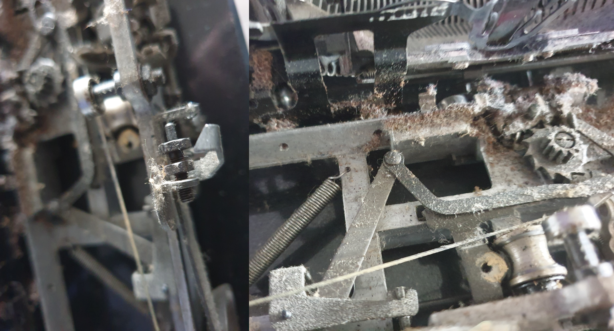

### Fixing The Carriage Release

While the main body was drying, I moved onto the carriage. I should also say that getting the carriage removed from the main body involves first dismantling the margin release. The videos I mentioned above show how to do this, but I also took some photos of the connections to make sure I put them back correctly afterwards. Most of the photos included in this article were originally intended to measure my progress or to help me put things back together (rather than as an explicit tutorial). This is a good thing to do, and I would highly encourage it if you end up undertaking a similar project.

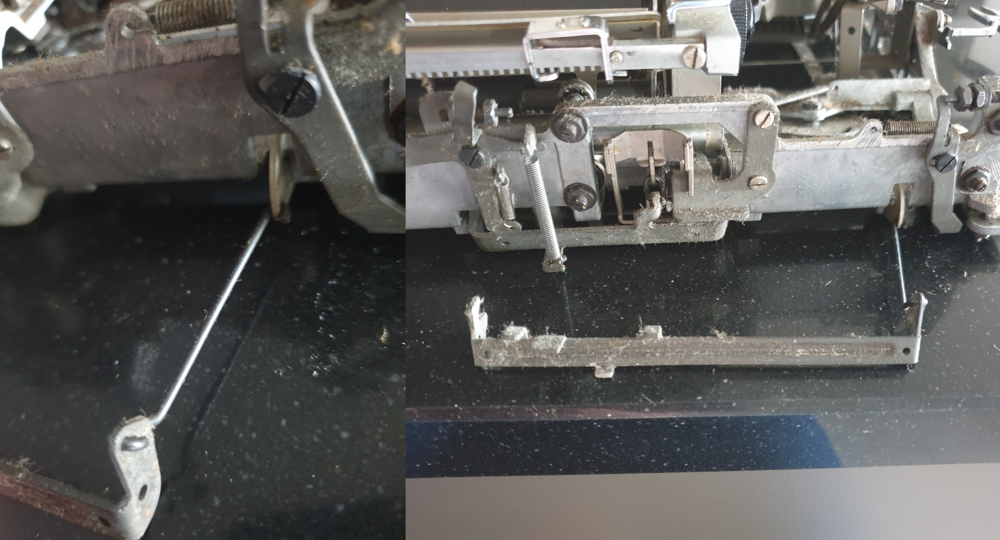

Dismantling the carriage was also a little tricky. Getting the platen off required me borrowing a very thin 4.5 mm spanner from my Dad (who has every tool, and is very generous about lending them to me). But doing so allowed me to see that there was some spring steel that had lost its elasticity. I gingerly tried to bend it back a little, but it immediately snapped. I'm not sure if this was a result of lots of use, time, or having been kept in the down position too long, but there it is.

I considered the best approach to this and ultimately decided the only thing that would work was to replace the spring. It occurred to me that I'd purchased a new spring from my Swiss Army Knife a year or two ago, and I'd needed to order at least two. Sure enough, I found the spare and it looked like it could work. I had to remove the rounded end part, and then file it to the right shape and size to match the original (I did all this by hand, and it was somewhat time consuming and required regular stops to recheck I was still on track).

I then took the non painted parts outside and put them through the same white spirit procedure as with the main body.

The painted parts of the carriage were then cleaned with Cillit Bang multipurpose spray. The carriage paintwork didn't have any scratches on it to cover up, so I just waxed it and moved on. I'll go into more detail about my paintwork cleaning methods later in this post.

The last thing to do before reassembling the carriage was to clean up the platen a little. I used Cillit Bang multipurpose to get the thick dirt off, then applied MG Chemicals rubber renue with a new microfiber cloth. I just put a little on the cloth, then rubbed it in. This stuff is supposed to penetrate the rubber to make it softer, but I suspect it also takes off a thin layer of the harder top rubber. If used too much, this could be an issue with getting the feed rollers to engage, so it's best not to overdo it. If a light application doesn't help, you're probably better off going with other methods (like using a backing sheet, or getting the rubber replaced by [JJ Short Associates](https://www.jjshort.com/typewriter-platen-repair.php)).

With the carriage fully assembled and looking good, I left it aside to work on the main spring.

### Fixing The Main Spring (Part 1)

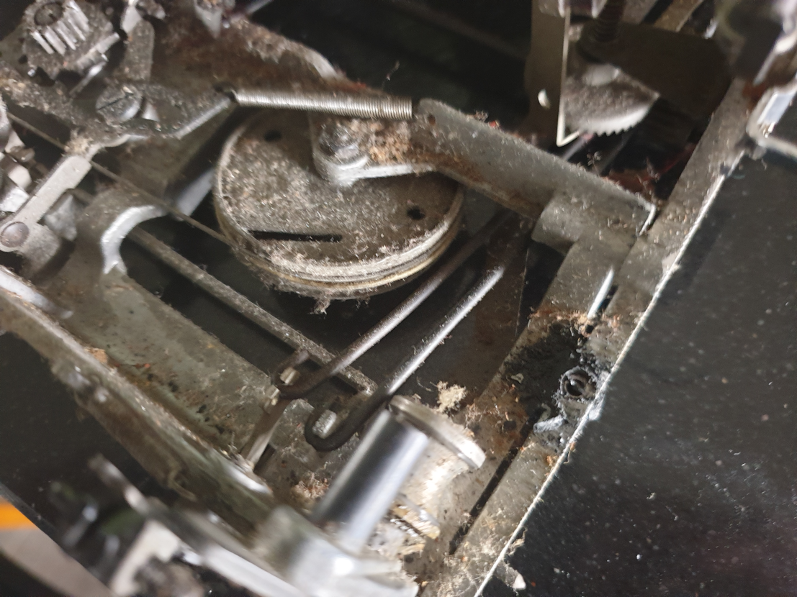

The main spring was easily removed by unscrewing it from the main body of the typewriter. Getting inside it just required prying off the case.

The end of the main spring outer coil was not seated in the slot on the outer casing, so I had to position it tightly in there before snapping the case back together. I was fairly certain this was the cause of the carriage not moving.

I also carefully removed the existing drawband, then cut an appropriate length of fishing cord and tied it to match the length, hoop, and knot of the original; then fitted it on.

I screwed the main spring back into place on the typewriter body, then reattached the carriage to test it out. It's quite tricky to re-tension the spring and then feed the drawband through the correct path to connect to the carriage, but I managed it (rubber gloves with extra grip made things easier for me). Each time I tested it, the carriage still lacked the force needed to get to the end of the entire line. I would then then add more tension to the spring (by wrapping the drawband around it an extra time) and trying again. It improved a little each time, but I was shocked at how much tension it seemed to need. Once I had it almost fully working (missing only the final inch or so of the carriage length), I tried one more tension pass... and the screw holding the main spring to the machine body sheered off.

I was highly disappointed. There wasn't an easy way to fix this with the tools I had access to, so the simplest (and cheapest) solution was to replace the entire main spring unit.

I searched online to see if I could find a drop-in replacement. There were some available for other Olivetti models, but they would cost slightly more than the typewriter. I then had a look to see if there were any really beat up Lettera 22 machines for sale. Sure enough, I found one that was listed as broken, and only cost £10. I took the gamble and went for it, knowing it wouldn't arrive for a few days.

### Fixing Carriage Lock And Brake Pad

While I waited, I decided to fix the last two remaining issues with the machine.

The carriage lock on the left of the machine wasn't engaging. It's essentially just a piece of metal on the main body that slides into a slot on the carriage to stop it moving. All I had to do was loosen the hinge screw, move it so that it engaged with the carriage at the right point, then screw it back in. A very easy fix.

The last issue was the missing brake pad. My research indicated that this was a simple cork pad that would slow down the carriage when the tab key was pressed. It had worn down and fallen off over the years, so there was nothing there now. I decided to grab a Champagne cork and carve it close to the right size, then shape it with my metal file. I didn't have an old one to compare to, so I just did my best to come up with a shape that I thought would work, and regularly put it in the machine to test it. Once it seemed to be doing the job of making it a little slower, but still largely free moving, I stopped and glued it to the machine with PVA glue.

It was tricky reaching a balance with the brake pad, because I knew there was already an issue with the drawband struggling to pull the carriage all the way along, so I didn't want to hinder that any more. Still, it seemed a good idea to protect the machine from the tab key being used when there were no tabs and doing a full carriage return.

### Cleaning The Shell

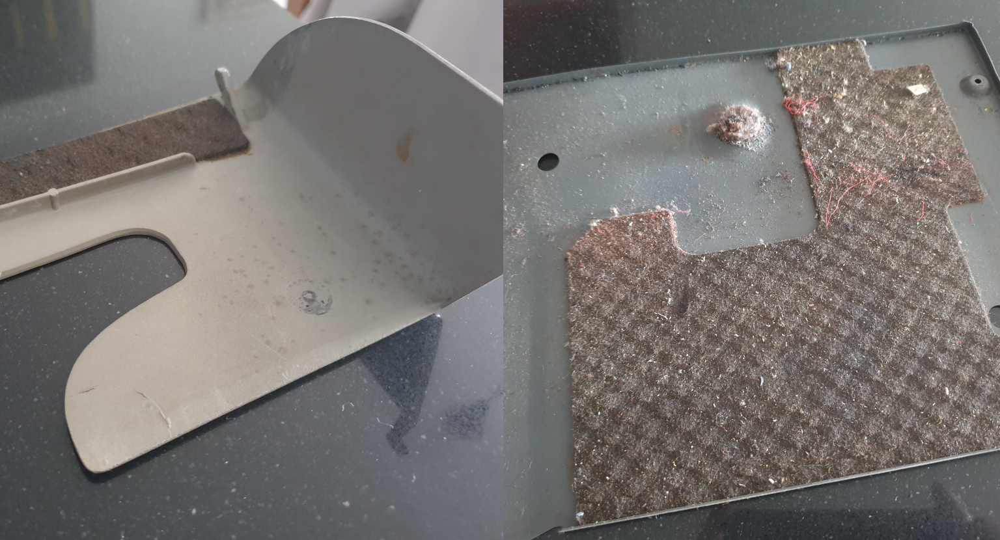

Apart from (hopefully) fitting the new main spring unit, the only thing left in restoring the machine was cleaning up the bodywork.

For getting rid of the dirt and grime, I used Cillit Bang multipurpose spray. You could try other cleaners, but I'd say the main thing is to use ones that don't rely on bleach or acetone as their cleaning agent. The paint on old typewriters can be stripped by some cleaners. If you're unsure, it's best to test a small amount with the paint on the inside of the shell that will not be seen if it messes up.

My approach is to spray a little onto a microfiber cloth, then rub the machine with the cloth to take off the dirt. I repeat this until no more dirt comes off. This involves a lot of elbow grease and takes a long time. I had to be careful not to bend the metal in any way, or to damage the paintwork by rubbing anything scratchy into it---or even rubbing too hard.

There was also a lot of spoiled rubber where the screws had released the shell from the body. I surmised there must have been rubber grommets there to maintain a solid grip on the shell and stop it wobbling or coming loose. I'd already ordered replacement grommets for this purpose, but I made sure to scrape away as much of the old rubber as I could to create as even a surface as possible, and to stop the old rubber from degrading and falling into the machinery later.

I also cleaned the interior felt the same way, but was careful not to rub so hard that I removed any. The goal here was just to get as much crud off as possible, and perhaps also help remove the musty smell coming from the felt. The original felt was all still in place and well attached, so I didn't have to replace anything or do any repair work there.

Even though it was on the machine, rather than the shell, I also took this time to clean the keys of the typewriter. I had to clean each one individually with the Cillit Bang, and make sure to get every side. I also cleaned the bars the keys were attached to with the Cillit Bang (I'd avoided cleaning them with the white spirit in order not to damage the keys).

Once everything  was as clean as I could make it, I then buffed off any Cillit Bang residue with a clean microfiber cloth. At this point, the shell was already looking very clean and shiny, but I could now more clearly make out some of the scratches and missing paint.

I wanted to cover up as much bare metal as possible to prevent any future rusting, or to stop the existing paint from flaking off further. I'd purchase some nail polish in close colours and tried to match it even further by mixing them together, but it dries so quickly that you have to be pretty fast with the application. I tested the paint on the underside of the ribbon cover first and let it fully dry for a few hours to see how well the colour would match.

It wasn't great. Not awful either. If I had more time to mess around with this, I'm sure I could have done a better job, but I had what I had. It's best to apply the paint in several ultra thin coats and allow it to fully dry between layers, rather than applying one thick layer. However, you also want to make sure you have enough paint that it goes on smooth and doesn't end up looking scarred right off the bat. It takes patience and skill, and I'm not sure I have much more advice to give than that.

Because the colour was never an exact match, I opted to put clear nail varnish on the smaller scratches and chips (lest it end up looking like a Jackson Pollock painting). This meant it was still protected, but perhaps not quite 'as new' looking as I would have liked.

Once all the new paint was dry, I got a new microfiber cloth, took a little bit of Renaissance micro-crystalline wax polish, and applied it to all the paintwork. You don't need an awful lot of this, but the goal is to gently rub it in until it starts to buff up to a bit of a shine. Once you reach that stage, you can get a clean microfiber cloth and gently buff it some more to really make it glisten!

### Fixing The Main Spring (Part 2)

A few days later, the donor typewriter arrived. Sure enough, it didn't work, but it looked like it was just a snapped drawband that was the problem. This donor also didn't come with a case or the tabulator function, but it was otherwise in decent condition. I felt a little bad stealing the main spring unit from it, but there we go. Hopefully it would supply a lifetime's worth of spare parts for my friend.

I removed the main spring and put it in the other machine. It worked fine and was one of the refurbished versions from when people sent their typewriters to the Glasgow plant for repair. This time I chose not to tension it past that last inch or carriage pull (it would still be enough to cover A4 and letter sized sheets).

### Reassembly And Final Adjustments

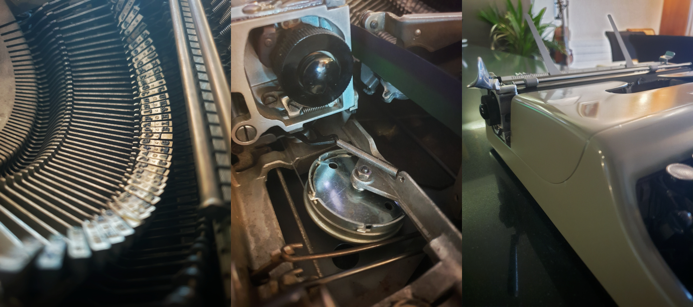

With everything all seemingly coming together, I fully reassembled the machine for the first time. This included putting on the four new feet, the four new rubber grommets, and the now-found ribbon spool cover (and new ink ribbon).

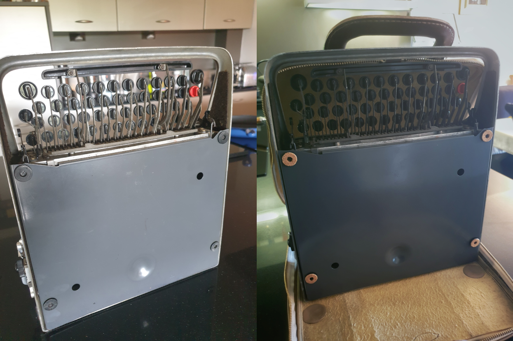

I was delighted; not just by how beautiful it looked, but from seeing all the repairs actually working. The typing was surprisingly clear and solid. However, some of the keys were definitely not aligned correctly. Not drastically. I mean, I actually quite like a little bit of wiggle with the letters on a typewriter (I think it gives them character), but this was to the point of being a little distracting. As such, I very gently used some spark plug terminal pliers to try to bend the typebars into the correct shape. The rubber ends on these pliers mean I'm unlikely to score the metal. However, I would be wary of jumping to do this yourself. I'd spent a lot of time determining there wasn't another mechanical issue causing the problem, and even then I was rather cautious about trying to bend metal. If you aren't confident in doing this, it's best to ask someone with more experience, or just learn to live with it.

In my case, I was lucky, and I got the letters all playing much nicer together. Not perfect, but not distracting any more.

At this point, the actual typewriter was basically back to fully functioning and looking great. Maybe not totally 'as new' but pretty darn close considering I didn't want to replace any parts or fully repaint the shell. Ideally, I'd also have gotten the platen re-surfaced, but it was working well and not too loud.

Delighted with my progress so far, I turned my attention to the much simpler, quicker job of restoring the carrying case. Or so I thought...

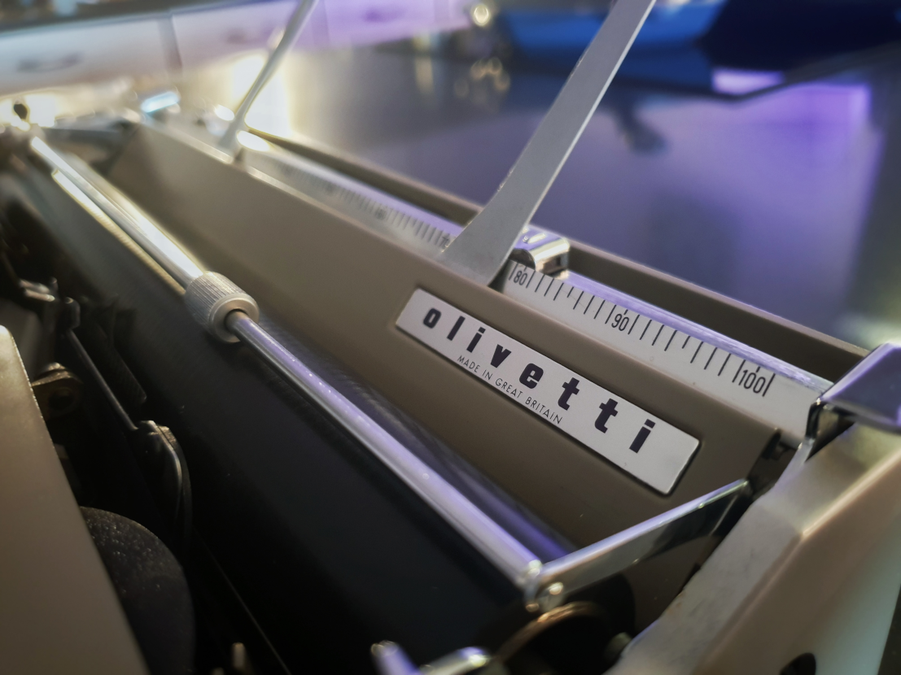

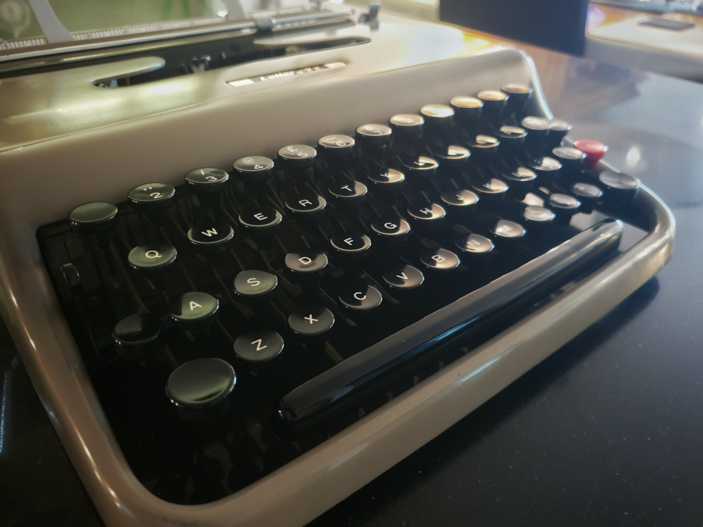

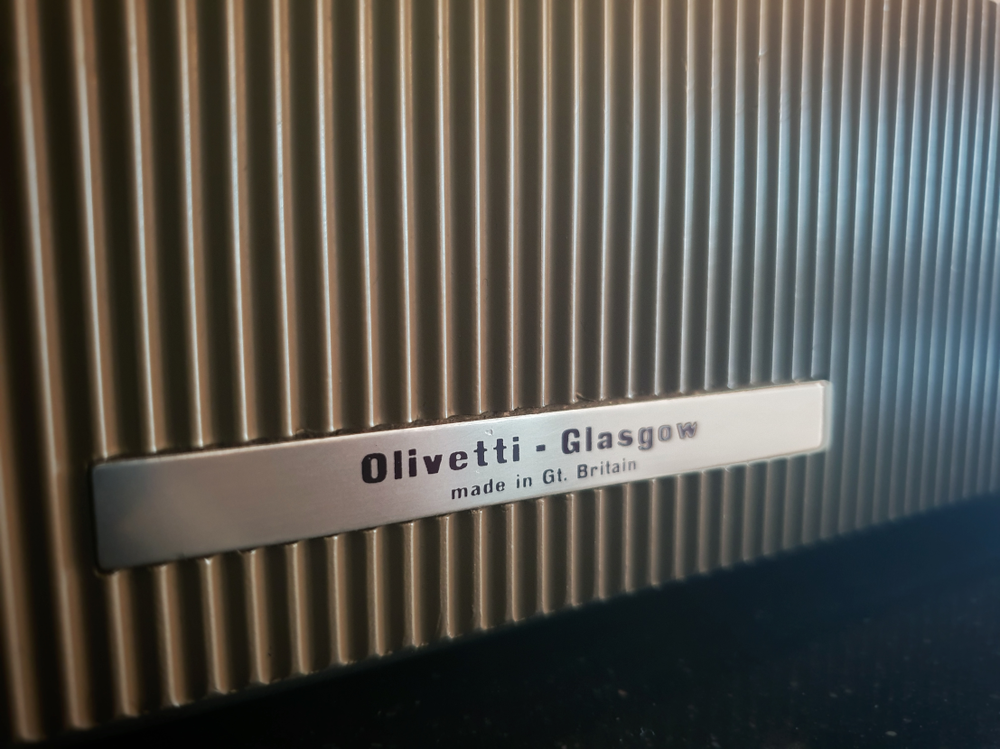

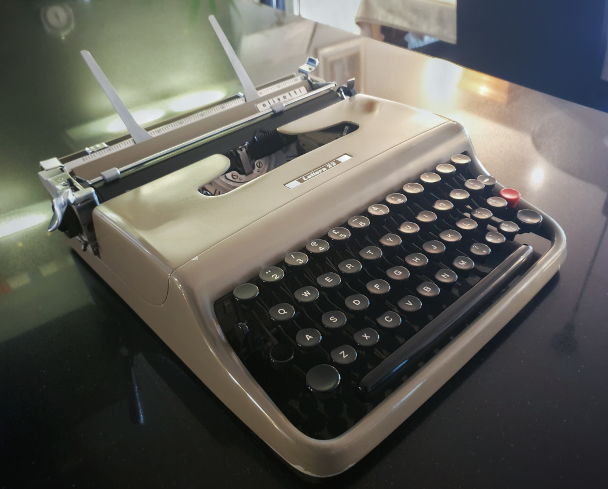

## Fixing The Carrying Case

My first job was to get rid of all the black stuff inside the carrying case. I was pretty sure it was degraded rubber from the machine's body shell padding grommets. I picked out all of that, and saw there were black stains on much of the case lining.

I decided to tackle the interior first and used Cillit Bang on much of the inside. There are ups and down to doing this. On the upside, it cleans things pretty well, and got rid of most of the staining. On the downside, it can pull off a lot of the lining, or make it clump up so that it's not so fluffy any more. I'm not sure if these downsides are a product of the Cillit Bang or my technique, but either way it lost some of its volume.

Once it was dry, I glued back on a loose foot pad on the interior. I assume these are there to stop the machine feet from eroding the lining. I just used some textile glue and left a weight over the spot to make it adhere better.

### Cleaning The Exterior

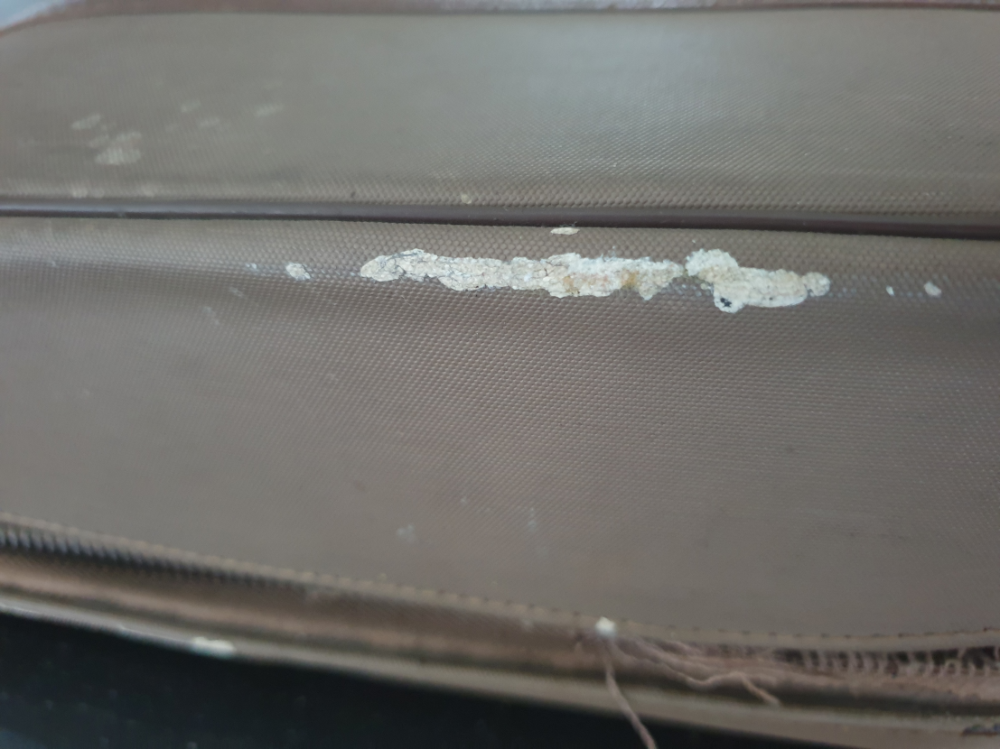

In much the same way that I cleaned the machine's body shell, I cleaned the carrying case exterior with a microfiber cloth and some Cillit Bang multipurpose spray. The only difference is that every now and then, I would switch to rubbing off the residue with a dry, clean cloth; then go back to applying more cleaner with the old cloth again. Due to the textile being somewhat absorbent, I found this was necessary to keep pulling out the dirty liquid that would otherwise be trapped in the weave. I tried to never let the textile get too wet, and I didn't use any water or other things to wash off the Cillit Bang. This was largely to protect the structural integrity of the carrying case and what remained of the original stitching. I have never fully broken such a case, but I would guess that what gives it its semi-solid structure is probably something like greyboard. If that's true, then it will only resist so much moisture before losing its shape.

It was a long process, and I was surprised at how much dirt continued to lift off the carrying case. However, eventually the case exterior (including the leather) was as clean as I could make it with this method.

Cleaning also revealed that the leather flap that closes over the zips was loose. I gave it a light tug to check how bad it was, and it completely came off the case. At least it made it easier to clean underneath. I left it aside to deal with later.

This did still leave behind some paint and other gunk that was trapped in the weave. While the Cillit Bang would have helped to soften and loosen these things, it wasn't enough to get them completely removed. My solution to this was to get a sewing needle and individually pick off anything stuck on or between the weave. This had to be done very carefully and slowly so as not to damage the weave. For larger areas of paint, I would gently rub the needle point back and forth across the paint to pull up what I could, but this would usually leave behind flecks within the weave, which I would still have to pick out individually. I did similar things with stuff that was on the leather trimmings, but I was even more delicate there.

The gunk (whatever it was) seemed to be vaguely sticky and was not easy to pick off. I suspect it was very old oil or grease that had splattered on the case.

As a side not: I'm in the camp of people that believes no oil should be used on typewriters. Or, at least, extremely sparingly. I never put oil on the segment or typebars because over time it will turn to gunk and jam up the movement. I have similar feelings about putting oil on the escapement. The only place I've ever really put any oil was on the carriage rail, and that was extremely sparingly and with very thin oil (sewing machine oil, or gun oil). In general, I'd ignore oil as a solution to typewriter problems. Old typewriters were manufactured extremely well and to very high measurement tolerances, meaning oil would negatively impact their performance. The parts that get most friction were also made of very hard metal and the chance or eroding them is very unlikely within your lifetime. If you do end up using oil, you have to regularly clean it off and reapply it to stop it gunking up (which is quite a laborious task in itself).

As for WD-40: ***never put WD-40 on a typewriter unless you're also going to clean it off***. WD-40 is a wonderful product for stopping things becoming rusty or frozen, and for unjamming things that are already rusty or frozen. However, it is *not* a lubricant. It may temporarily have a lubricating effect, but it turns to sticky gunk quite quickly and is then a real pain to clean off.

But anyway, once I'd picked out all the paint and gunk, I gave everything one more go over with the Cillit Bang and then rubbed off any residue.

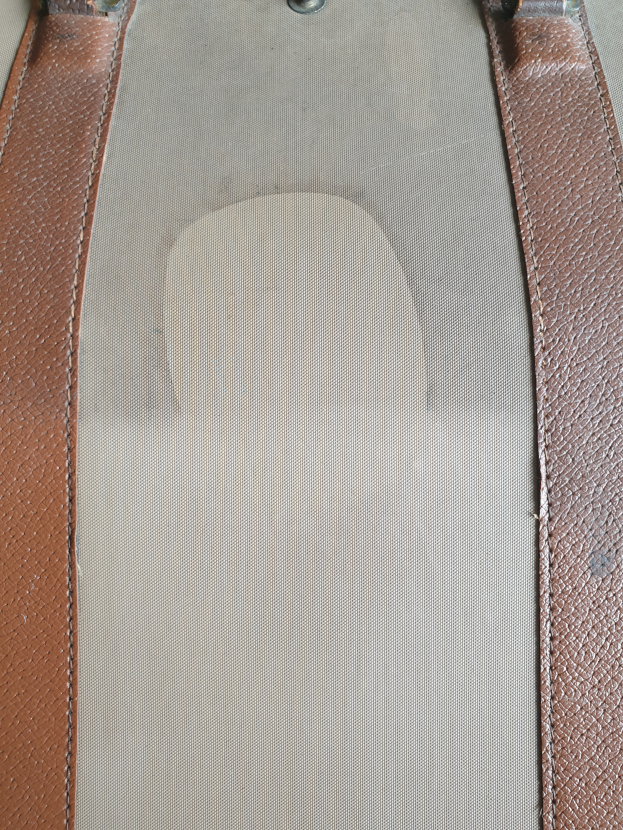

### Fixing The Tears

The tears on the 'hinge' of the carrying case worried me. I felt I should try to stabilise and repair them now to prevent them from getting any worse. On the upside, they were fairly clean tears and hadn't lost any material.

I'd already measured out the zips and knew that I'd be chopping them down at the ends. As such, I cut off a little and carefully removed the brass from the textile. This left me with a very strong textile material that I could glue to the back of the tears to give them some structural integrity before I sewed them back in place.

I had to remove all the thread and stitching that remained to give me a clean sewing line for later. I then used some of my textile glue to affix strips of zipper material to the inside, out of sight. I applied quite a few, allowing them to dry each time and doing my best to hold things in place without also gluing my fingers to the carrying case. My goal was to create alternating rows to increase strength, across the tears and down the stitch line. Once I felt I had enough, I moved on to the zippers.

### Replacing The Zippers

This turned out to be the most time consuming part of this entire adventure.

My first job was to remove the old, rotten zippers. I did this by very carefully and gently applying a seam ripper to each stitch from between the zipper textile and the main case textile. My thinking was that if I scratched anything, it would be hidden from view. It did take a long time though because I still wanted to prevent any accidental damage.

When I got to the crossover point where the two zippers meet under the handles, there were two pieces of rotted leather covering up this spot. I felt they were too far gone to repair, so I removed them as best I could with the careful use of a scalpel blade. If I was really doing things properly, I would have removed the stitches on the case piping (under which they were attached). However, I really wanted to avoid having to unstitch the piping. It was still very solid, and I wasn't sure I'd be able to easily repair it neatly.

I also had to peel pack some of the interior lining near the 'hinges' because the zipper ends have to be placed behind them.

Once both zippers were free and all the loose thread removed, I pinned a length of one of the new zippers to the bottom of the case, making sure that the 'top' of the zipper was placed at the right point under the handles. I also made sure that it was going to be a little slack on the slope at the back and around the hinges to make it less likely there would be ripping in the future. I wanted to keep the 'top' of the zipper fully intact, but the 'bottom' would have to be cut. This meant losing the connector point, so I had to be careful to make sure the zipper was already zipped before removing it, and then make sure that it was never fully unzipped for the rest of the restoration. Eventually, this would be protected by having the end hidden under the lining, but until then it was a very dangerous possibility.

This first length of zipper was the easiest, as it didn't have to line up with any other bits of zipper. But it was still hard going. I was using the Gütermann thread, but had cut one very long piece about five times the length of the zipper. I then threaded each end into an identical needle (and a relatively thin one to match the existing holes). I then proceeded to saddle stitch the zipper onto the case.

I'm not going to go into detail about how saddle stitch is done. There are plenty of videos online to show anyone that's interested. But I will say that I did use an awl to widen the holes long enough to get each needle through; I was very particular about checking I didn't sew one thread through another; I made sure to keep the stitches nice and tight as I went along; and I made sure that the zipper textile itself was always relaxed and never stretched. I think the most difficult parts were keeping the zipper the same distance out from the case, and making sure that each stitch came out of the same hole that it started from.

That last part was what proved most time consuming. The needles really did not want to travel through the case material (although the awl did help), and certainly seemed reluctant to stay on course all the way to the other side. I accidentally made quite a few new exit points, but they seemed to be largely invisible when I pulled the needle back. I really can't emphasise enough how long and fiddly this part of the project was. I'd expected to do it in a day, and I think it was closer to a week of work. Using a thimble to push through was also key. I initially tried to do it without a thimble, and the back of the needle ended up going through my finger. That's not hyperbole. It was near the edge though and didn't produce any blood, but it definitely would have been better to avoid this entirely and just use a thimble from the beginning.

Each subsequent zip attachment had to match or line up with what had come before, and the upper zips had to be prevented from becoming out of line with the lower ones. I checked this regularly by closing the zip and making sure it wasn't stretching. The zips on the right also had to match the zips on the left in terms of finishing spot, and in terms of how far they came out from the case. It was a constant loop of stopping, checking, carrying-on, then repeating these steps---all the while being frustrated at how long each stitch was taking to match the existing holes.

It may not be obvious to everyone why I felt the need to match the original stitch holes. There were two reasons: the first is that it would simply look neater when done and be as close to the original look as possible; the second reason is that each new hole in this plastic-like material would weaken its structural integrity and make it much more likely to rip in the future. This was something I didn't feel I could compromise on, and was fundamental to a good restoration of the carrying case.

It was very fiddly doing the ends of the zip that got tucked away under the lining near the 'hinge.' Since I wanted to limit how much lining I was prying off (not sure how well it would reattach), I was having to contort my fingers in unfortunate ways. And that's before we take into account that the needles also had to be manipulated from between the outer 'hinge' and main case body. This was both difficult to see, and hard to reach. And, of course, that little bit of zip had to be kept closed the entire time to make sure it matched up, which meant the carrying case was almost fully closed as well.

Still, I managed it, and was pretty pleased with my efforts. Both zips closed fine and ended at the point I wanted. This was the first time that I'd really seen it look close to a functioning case. I paid particular attention to having lots of thread anchor stitches at the zip crossover point when attaching things, because I knew this would receive the most strain. I tried to minimise new holes by going through the same ones in different patterns; creating strength without losing integrity.

I then cut two small leather strips to roughly match the original ones from the zip crossover point (making sure it would definitely cover the original staples, and my ugly anchor threading). I bevelled the raw face edges with a special tool. After that, I applied tokonole gum to the raw face and burnished it. The reason for this was to make it more water tight, and less likely to rot in future. After this was done, I left it to fully dry in.

I used my awl to evenly space out holes that I could sew through, making sure they were symmetrical on two axes. This was because each strip was wrapped around the zip crossover, so the thread needed matching holes on the top and bottom (but also on the left and right in order to be aesthetically pleasing). Again, this was done with saddle stitch, but I used the leather thread and slightly larger needles. Once I'd got them attached at the top and bottom, I felt it was actually too tough for me to reliably create holes all the way through, so I ended up not doing the vertical stitches. This meant there were unused holes on the leather, but I felt it still looked attractive enough to leave it, and they felt solidly secured on.

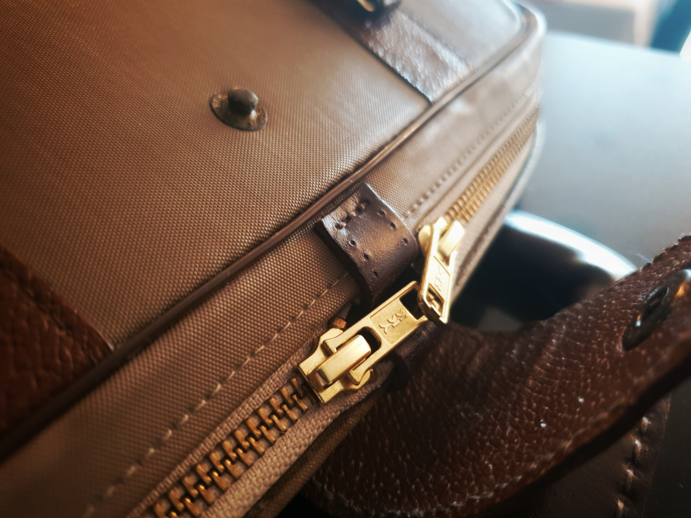

With both zips in place and working, I glued down the inside lining. Once that was dry, I then glued the 'hinge' to the back of the main case body. This required using proper clamps to form a good seal. This was all done with textile glue. I left this for 24 hours to fully adhere.

The following day, I then saddle stitched the 'hinges' back onto the main body, using the original holes. It was a straight line down, but because I was now going through the lining (a choice I made), I had a lot of difficulty in matching the entrance and exit holes. Mostly I would put the needle into the case from the outside holes, then try to match the other needle to the point the first one had come in from. This, of course, was after I had gingerly felt around with the needle to make sure I was finding an existing holes and not creating a new one somewhere mid-hole. I'm not sure I managed it every time, but I did my best. Again, this was very time consuming and fiddly work.

Once I was done, this meant that the zipper ends were finally protected from coming apart again, as I'd sewn them in with the hinge, and the hinge itself (and inner lining) now meant the zipper couldn't move far enough down to come apart fully.

Things were really taking shape now, even though it had taken a long time to get this far.

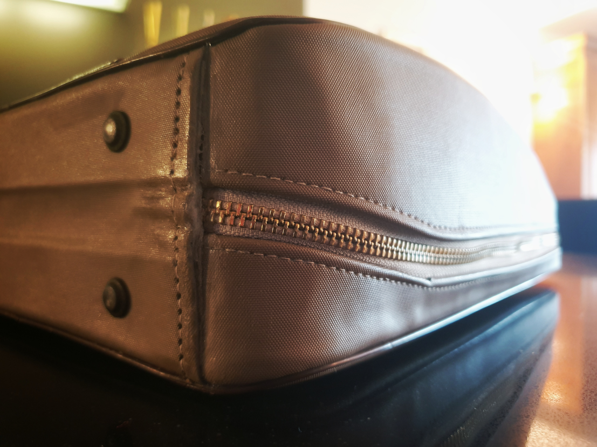

### Fixing The Leather Flap Closure

The leather flap that covers over the closed zipper flies was still not looking great. It was made of two pieces of leather sewn together, but the thread had perished allowing the two pieces to come apart. It was also clear that there was some red rot starting to take hold of the leather.

Having done a little bit of work in book restoration, I'd learned that a mixture of Klucel G powder and isopropyl alcohol could be used to stabilise red rot in leather. I'm not entirely sure of the chemistry, but it works very well. If made thick enough, it can also have a glue-like effect.

I prepared the mixture and applied it liberally to both pieces before clamping them together. The following day, it looked like the Klucel G had done its job, and I began attaching the two pieces together with the leather thread and a saddle stitch. As with the zippers, I only used the existing original holes.

The original holes on the case from where it had been attached were also still there (though looking very clean and shiny). I reattached it using the original holes on both the case and the flap, being very careful to make sure I was lining up the correct ones. As with all my other saddle stitching, I made sure to keep things nice and tight.

Since I didn't want to mess around with the case's inner lining too much so far from an edge, I decided to just sew straight through. I'm sure the original method had been to apply the lining after this sort of stitching, but I was hoping the fuzziness of the lining would somewhat hide my blunt force approach.

I can't honestly claim to have really gotten away with that. Even though it was still visible on the inside, it didn't look too bad. At least it was a neat job. Functionally, it worked great and felt very solidly attached.

Once in place, I applied some leather conditioner to it and to the leather trimmings on the main case. The carrying case almost looked finished at this point. The one thing letting it down was the poor shape of the leather handles.

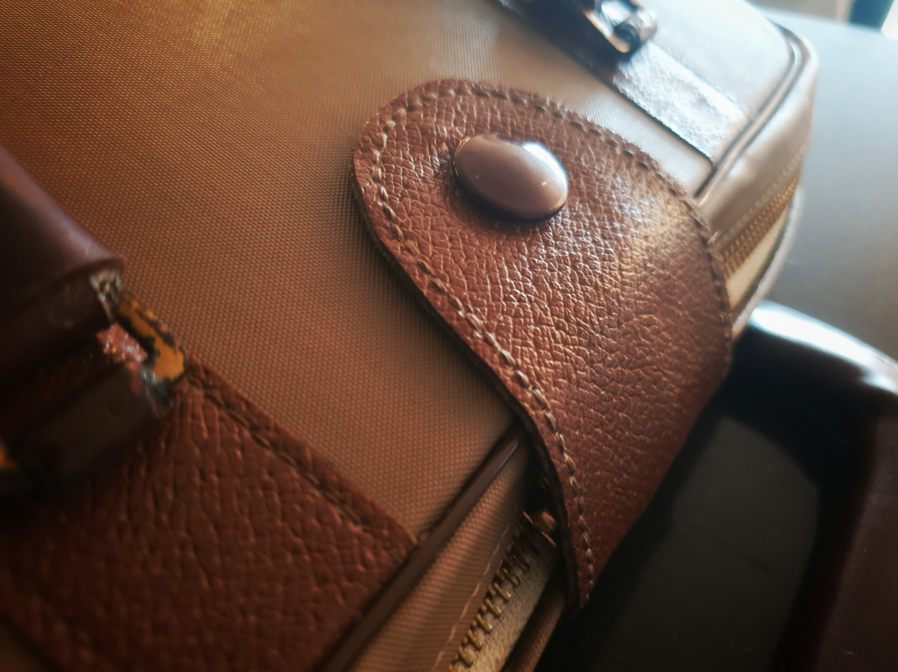

### Replacing the Handles

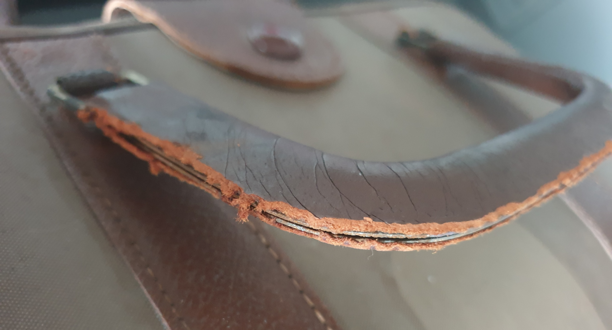

I'd been a bit worried about this part of the project, because I've not done a great deal of work shaping leather. Still, I'm always up for giving things a shot.

The old leather was removed from the handles by using a seam ripper on the threads, and prying things off with a butter knife. The existing leather had been glued onto metal structures, and then sewn over. Really, it was these metal structures that were doing all the functional work. The leather was merely for aesthetics and to make it more comfortable to hold.

I really wanted to make sure I got the leather off in one piece though. I was going to be using each one to create a template for the replacements, so I felt this was key. Had I actually done this sort of thing before, I'd probably not have needed to worry so much and could just have done my own templates, but it's always best to be cautious when stepping into the unknown.

After successfully removing both leather covers in one piece, I scraped off any remaining glue that was left on the handles. I wanted to get it as close to bare metal as possible to help with adhesion when I glued the new leather on. I suppose I could have tried to do this chemically, but in the end I just scraped it all clean and shiny.

I tried to flatten out the old leather as much as possible to create a template. Both handles used the same design.

Once I'd cut out the new pieces with a scalpel, I bevelled the edges on the raw faces, applied tokonole gum to the raw faces, then burnished the raw faces. Once that was done, I tried to turn the flat shape into something that would conform to the handles.

Since I'd bought very high quality leather, there seemed to be two options open to me: the first was to pare the leather with a pairing knife (again, something I learned from bookbinding). This would have involved cutting leather from the raw face to make the overall piece thinner. I'd already decided against this (otherwise I would have done it before bevelling and burnishing). My reasoning was that the thicker the soft leather was, the more pleasant it would be in the hand. The original leather seemed very thin, which was probably why there wasn't much give when holding the handle.

The other option was to relax the leather to make it more supple, then wet it with the Klucel G before applying it to the metal handles. The Klucel G would add to the suppleness, whilst also acting as a glue. The first stage, though, was to forcibly bend it into shapes it didn't want to be in for a few hours. This was quite the work out.

Once the leather felt broken in, I applied the Klucel G and pushed it into the handles to try getting it to form the shapes I needed.

This didn't really work.

I mean, it helped a bit, but not much. In the end, I decided to just let the Klucel G dry, then punch all the holes for doing more saddle stitch. I did this with an awl and, again, had to be very careful to line up the holes on both sides of the leather to match when it would be wrapped around the metal handles. This was quite difficult, and I ended up lightly threading through previous holes in order to prevent drift as I did later ones.

With this done, I applied more Klucel G, put the new leather on the handles, and just starting sewing it on real tight in order to make it conform. Again, I used a thread about five times longer than the handle in an attempt to avoid having to start a new one half way along. Amazingly, this worked pretty well. At the corners, it was definitely a lot more effort and it was a little sore on my hands. I was having to pull the leather thread so tight that it was cutting into my skin. Once I drew a little blood and decided I'd need to wear work gloves for some of those parts to protect my hands.

Apart from maintaining the super tightness, and making sure the shape was being formed correctly, it was really just back to saddle stitch like I'd been doing all through the project. I did end up starting a little of the other end of the handle with temporary stitches, though. I was worried it wouldn't conform correctly otherwise. These stitches were removed when I eventually got to that end, but I still think it was the right move.

When the work was done, I did a very tight triple knot, then cut off the thread to keep it quite short.

I accidentally got a little Klucel G on the tanned face of the leather. I'd been trying to avoid this because I thought it would look bad, and indeed it did. I ended up carefully picking it off, but it slightly discoloured the leather in that spot.

Once both handles were on, I applied more leather conditioner and was very pleased with how the carrying case was looking. All the repairs had been done, and everything worked, and I was just so pleased that things had actually come together the way I'd hoped.

### Protect And Shine

The last thing I did was to take my Renaissance micro-crystalline wax polish and apply it in exactly the same way that I had on the typewriter bodywork. This was a fairly quick job, and would add more protection to the carrying case. Plus, once it was all buffed nicely, the case was practically glowing with how shiny it was.

Although everything now looked and operated beautifully on both the carrying case and the machine, there still lingered a little bit of that musty smell. My cleaning had definitely brought it down from a ten to a three, but it still remained.

My solution to this was first to leave the typewriter and case out in the sun (with the ribbon safely stored somewhere to prevent it drying out). I took the ribbon cover off too, and left the carrying case propped open.

After a few hours of this, I put the ribbon cover back on and put the machine back into the carrying case. Then I took a dryer sheet and folded it to fit nicely in the typewriter basket before zipping up the carrying case.

After a week, everything was already smelling fresh and scented, like clean laundry. I've done this with quite a few of my typewriters over many months, and it seems to really help draw out the mustiness and any lingering smells.

With a new ribbon on (I get mine from [Charlie Foxtrot](https://charliefoxtrotvintage.co.uk), but there are lots of suppliers online), the machine really did feel almost like new... almost.

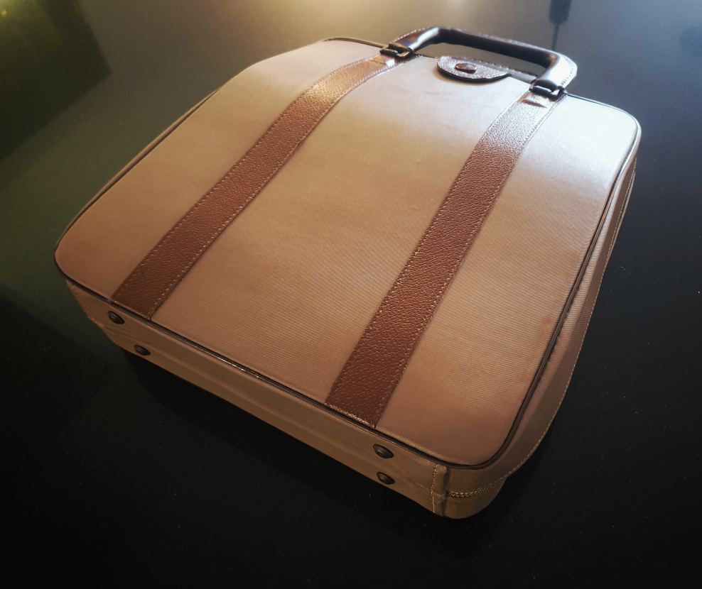

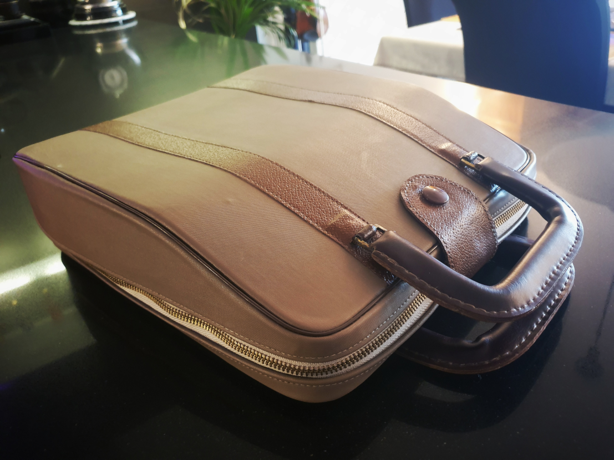

## Taking Stock

I was delighted at how well everything worked out. The machine operated almost like new. I typed up a few test pages and really enjoyed the feel and response. The type itself was crisp and clear, with just enough wobble to give it some character and charm. My friend was delighted with it too. It really warmed my heart to see their reaction, and I hope they have many happy years of creating worlds with it.

While the machine and carrying case looked great, I felt I'd not quite achieved my goal of having them look like new. I think this comes from keeping as much of the original as possible. If I'd really wanted the machine to look like new, I'd have stripped the paint and applied new stuff. And if I'd really wanted the case to look like new, I'd probably have just made one from scratch.

But that's not who I am.

I like to preserve as much classic quality manufacturing as possible, and look after well made things.

I suppose that's why I enjoy these projects. I'm not sure I'd be happy renovating just any old thing. But when something was made with real craftsmanship, strong design, or superior quality, I feel like I'm doing a service to those original artists who worked on it. I admire people who put their all into making the best possible thing they can, and believe building with quality is the only way.

I feel we're losing that. There are definitely well made items in the world today, but they're the exception rather than the rule. Today's most successful products have planned obsolescence built into the design, and stripped back features they can add to the 'pro' version three months later. Loyalty to high quality brands is lost in favour of saving a little money. And when we do demonstrate a cult-like following, it's to companies that treat us with contempt by making poor products with maximum profit that'll keep working just long enough for us to want to buy the next model.

We chase fashion instead of functionality, and quick dopamine hits over lasting happiness.

But there is a better way, my friends. Choose quality. Choose products that put your satisfaction above profit. Chose to support companies that don't exploit people to save you money and increase their margins. And once you've made that choice, look after your stuff. Take pride in knowing how to fix and maintain things. Find well made cast-offs and bring them back to their former glory. Be more than a consumer: be a custodian.

I really enjoyed this little project. Well... quite a large project, as it turned out. I found something that was almost 70 years old and broken. I took that, and I made it something that people might actually want; something that people might actually have a use for. I really feel like I've given it a second chance at life, and that makes me so happy and proud.

I'm glad I could make that happen here, and I invite you all to do the same. Be a custodian, and give something a new chapter.

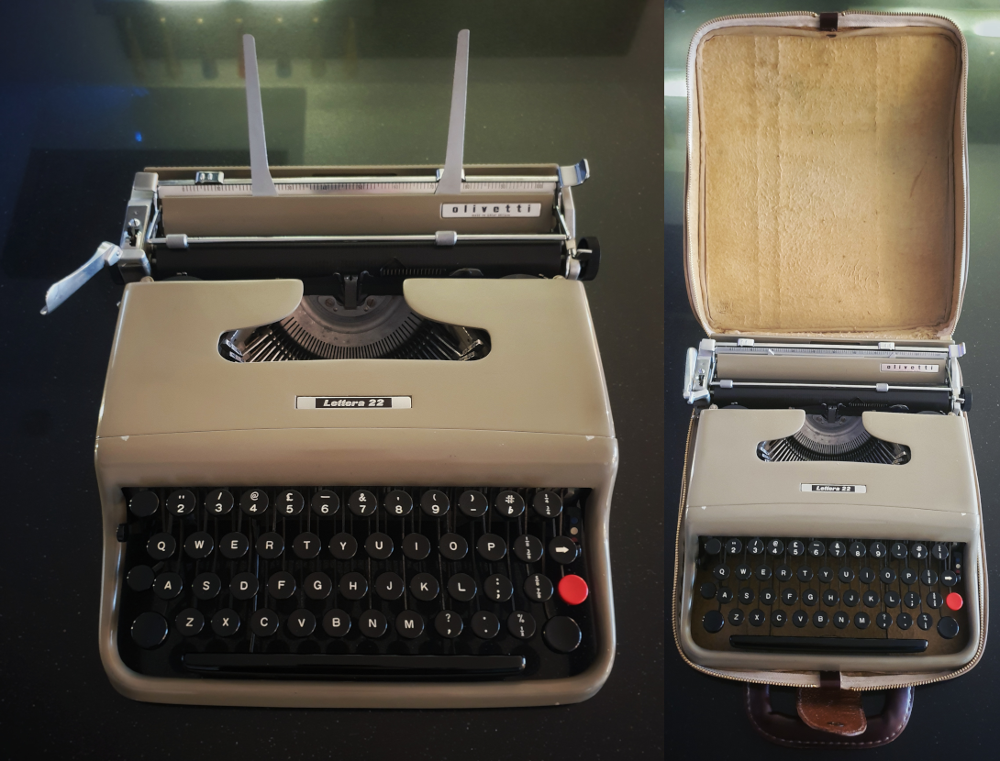

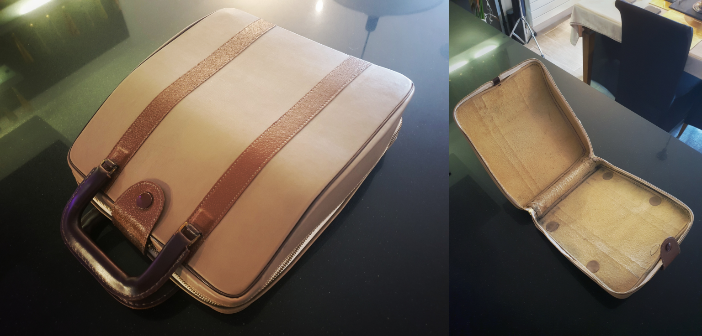
