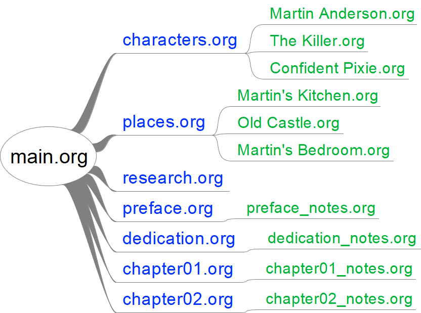
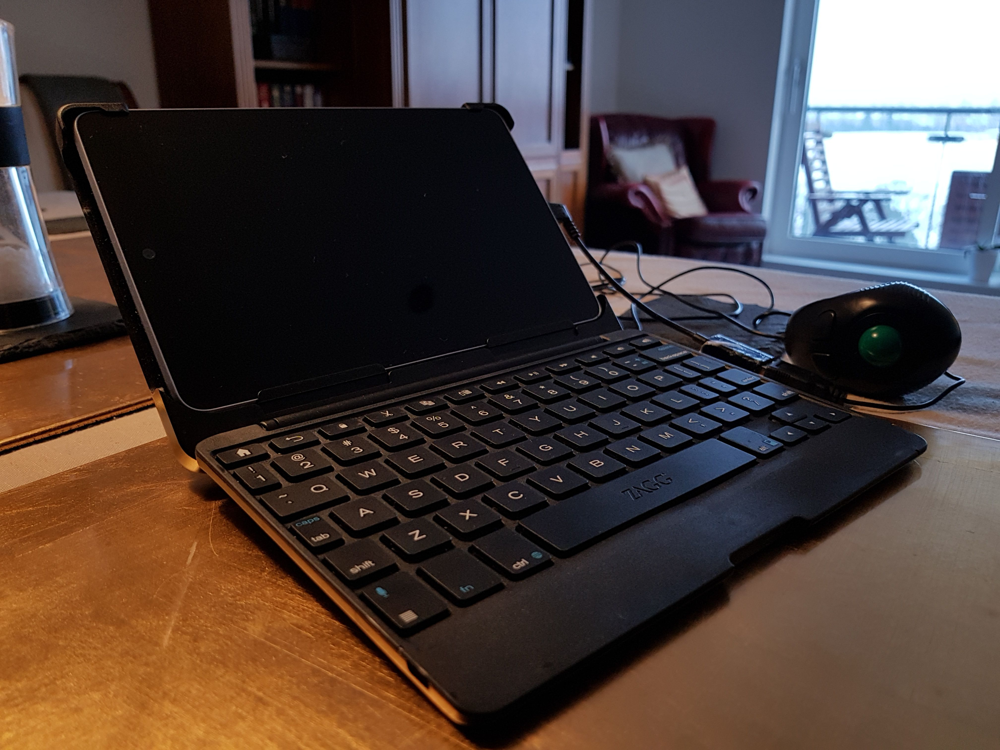
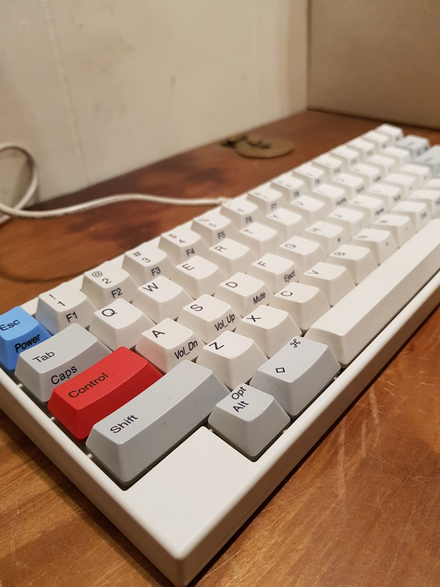




# Instructions

- [ ] Encourage engagement and interaction
- [x] Keep all blog entries as leaf bundles (for example, `hugo new content tech/blog-entry-name` with no .md creates a leaf bundle in the tech section)
- [x] Create a banner image (post-cover.png) in your leaf bundle that is dimensions: 962x520 (1.85:1)
- [x] Still manually add banner image into page content, first thing before anything else using the banner shortcode
- [x] Add any other images you use to the images front matter array (this is purely to help with OpenGraph generation)
- [ ] You can use up to two more images in the blog entry, but try not to use any more (unless this is a listicle). Only the banner is essential
- [ ] Try to write 1000 words. The closer to this number, the better, but don't go over (75% of the public prefers reading articles under 1,000 words)
- [ ] Reading time should not exceed seven minutes
- [x] Make sure to include a description and summary for the blog entry as these are used on the site and in SEO
- [x] Make an appropriate choice of tags in the front matter. These will help in recommending pages to the reader
- [x] Make an appropriate choice of categories in the front matter. The first category will be used in the breadcrumb for the page, others will generate the side menu
- [x] Use Emacs to generate the reading ease and grade level (this should happen automatically when saving the file in my Emacs configuration). These are just for fun, incidentally, and appear to have no impact on audience engagement
- [x] Set the draft to false when you want to publish, then push to GitHub
- [ ] Drop a video announcing this post on Instagram etc, and post anywhere else you can as well. Reels and videos work better for engagement
- [ ] Consider what tomorrow's article will be, and try to post a new one once a day (more is fine)


In December 2016, I took stock of whether I'd achieved my yearly writing goals. I had not.

I considered how to improve things, and settled on the notion that my tools were not good enough. As a classic [yak shaver](https://en.wiktionary.org/wiki/yak_shaving), I determined that I needed to improve my writing software; setup web publishing; publish to more formats; get a portable writing computer; get a better keyboard; purchase a writing bag; create a marketing strategy; and select better fonts for both writing and publishing. You know... because that's more efficient than sitting down and writing.

I was at least efficient enough to get a working version of this vision within the first month of 2017. However, I then spent most of the year tweaking it, starting from scratch, tweaking the new version, and then starting from scratch a second time.

I thought it might be interesting to log my tool journey, and then discuss its effect on my productivity.

## The Writing Setup 

I decided that I wanted a portable writing setup. I had rose-tinted visions of sitting in a café, writing master-works, and drinking tea. Also, since I travel around a lot, it would make it easier to write on the move.

When I say 'portable' I mean that in two ways: portable in the sense of a small computer I could take with me for writing; and portable in the sense of having a system that allows me to change computer and pick up where I left off.

### The Beginnings

Having decided that Emacs was the keystone of my solution ([which I've written about previously](/tech/why-i-use-emacs-for-writing/)), I looked at ways to improve it. My original solution involved three programming languages and multiple programs for each new story. It also relied heavily on Linux command-line utilities. The solution was overly complex and cumbersome, and required a lot of effort each time I started a new story. Still, I lived with this for the first five months.

Why did I put up with this? Well, once I'd set up a story, I could do all my writing and editing in one place, and then automatically publish it to my site, an e-book, and print. This level of flexibility was a major improvement over my previous writing solutions. It also meant that I could write from more devices, and that my solution would probably continue working long into the future.

Additionally, it had all the benefits of my previous setup. I wrote in [a previous article](/tech/why-i-use-emacs-for-writing/) that [Scrivener](https://www.literatureandlatte.com/scrivener.php) was my preferred writing solution before [Emacs](https://www.gnu.org/software/emacs/), and that it's great for outlining and planning. However, Emacs is capable of these features as well, but it's non-obvious when you're getting started (since Emacs isn't really designed for this purpose). It's also slightly more effort than in Scrivener because you have to set up some stuff yourself. I'm still deciding whether I want to automate these features, or continue doing them manually each time.

The process involves using Emacs Org mode to link documents together. I've seen other people using Emacs to achieve a similar system with a single file. However, I favour having well-organised, smaller files over a single, monolithic one.

Below is a visual representation of the files in an average story and how they link to one another. All these files live in the same directory and were created manually.

'main.org' is the entry file to the project. It is the gateway link to everything else, and contains general notes for the story.

The characters, places, and research files contain more specific and organised notes. My character profiles all use the same template, but so far I have not automated this process. The same is true for the places files.

The preface, dedication, and chapter files all contain text that will make its way to readers. These files are precisely formatted and have metadata headers at the beginning. This is necessary for processing by the programs I've written. Each of these files also links to a separate notes document for things that I don't want published.

This layout, naming, and formatting of files is all necessary for the Writing Setup to work. The programs I have written are not especially robust, so a story that is not organised this way will not work. I don't have much interest in making the system more robust though; the current setup forces me to keep all my files tidy.

However, it would make sense to automate the process of starting a new story. This is on my to-do list.

It took me the better part of a week to come up with this system of laying out, naming, and formatting my story files. I studied my past projects in Scrivener to replicate all the features I used. I was pretty happy with it, and now needed to figure out ways to output the story content to other formats.

I had already come up with a solution for a writing computer; installing Linux onto a second-hand [Nexus 7](https://en.wikipedia.org/wiki/Nexus_7_(2012)) tablet inside a [keyboard clamshell case](https://web.archive.org/web/20150910212501/https://www.zagg.com/uk/en_uk/keyboards/auto-fit-7-8-10-inch-tablet-keyboard) using a tutorial from [NODE](https://web.archive.org/web/20170105161220/https://n-o-d-e.net/ubuntu_laptop_how.html). It wasn't amazing, but it worked as a proof of concept to get me going. Of course, I could only use programs that worked on Linux. Windows now includes a compatibility layer with Linux, so that meant these things could still work on my other computers as well.

I spent another couple of weeks learning systems that I thought would be useful: [sed](https://en.wikipedia.org/wiki/Sed); [awk](https://en.wikipedia.org/wiki/AWK); [bash](https://en.wikipedia.org/wiki/Bash_(Unix_shell)); and [grep](https://en.wikipedia.org/wiki/Grep). I then wrote some scripts that utilised these programs to go through my story files and output different formats. These programs were a little slow and [kludgey](https://en.wikipedia.org/wiki/Kludge), but they got the job done.

Other parts of my writing setup are less specific to writing, but I already knew them and felt they would be useful. These included the [LaTeX](https://www.latex-project.org/) typesetting system and the [Git](https://en.wikipedia.org/wiki/Git) version control system.

An important part of the setup was the ability to publish directly to the web. Being the yak shaver that I am, this meant making an entirely new [site](/tech/why-i-built-this-website-in-hugo/). I won't get into that too much here, but it took a while to get that going.

I now had a working version of my system: a portable computer (that was pretty janky); a single program to work from (Emacs); the ability to publish online (and multiple other formats); and the general feeling that maybe it was time to do some actual writing. So, I used my system to complete a story called *Soulstice*.

### The Rewrite

After completing Soulstice and seeing that the system worked, I decided to re-code everything I'd already done.

This might sound ridiculous, but it's not that uncommon in Computing Science (the discipline I'm *actually* trained in). It's called refactoring, and it's usually used to retain existing functionality while making the system easier to maintain and extend, and possibly to make it run more efficiently.

It might also be surprising to discover that this took me about three months (when the initial version only took one). I can't really account for this, especially since the second version wasn't all that much better than the first.

### The Reboot

It was also around this time that I got a new writing computer (a [GPD Pocket](https://web.archive.org/web/20170411101633/http://www.gpd.hk/pocket.asp)). It's a little laptop that runs Windows 10 and fits in my pocket. My friend named it Parker. In switching back to Windows, however, I was finding the reliance on Linux utilities a little tiresome. Although I wanted to keep the 'future proof' nature of my setup, having to do so much work through an emulation layer in Windows was proving inefficient.

Through all this, I'd been getting more familiar with Emacs, and was starting to become increasingly impressed with the extent to which other people had managed to modify its abilities. Most of these went far beyond what I was doing and relied on Emacs' built-in programming language, [Elisp](https://en.wikipedia.org/wiki/Emacs_Lisp). After investigating this in more depth, it appeared possible for me to do everything I'd been doing in the command-line directly inside Emacs by writing my own Emacs Lisp functions.

As a consequence, I didn't really get a chance to work on anything with the second version of the Writing Setup. But I loved the third version (the Emacs Lisp version). It ran much faster, was much more convenient to use, and was even more future proof as it reduced the number of programs I was relying on. However, I soon decided to refactor the whole thing once more to make sure the code would be maintainable in the future.

At this point, everything was running well, and was a delight to use. I was doing a lot more writing and starting to feel like things had really paid off. I'd also spent some money on a nice computer keyboard (a [Happy Hacking Keyboard Professional 2](https://en.wikipedia.org/wiki/Happy_Hacking_Keyboard)), and investigated the possibilities of [bullet journals](https://bulletjournal.com/), and fountain pens.

The only other improvements I made at this stage were to introduce another output format (manuscript format for submitting stories to publishers) and to change the default font in Emacs. I splashed out on a typeface called [Triplicate](https://typographyforlawyers.com/triplicate.html) (I used the T3c variant in Emacs). This might seem like an unimportant thing to mention, but the typeface you use when writing has a large impact on how much you'll enjoy the experience. There are other fonts which are probably as good as Triplicate if you don't want to spend any money though (I now use [Iosevka](https://be5invis.github.io/Iosevka/) Fixed, and Iosevka Aile).

And that pretty much brings us up to date.

### The Future

The writing setup hasn't changed much in recent months, and I suspect there won't be major changes for a while.

It would probably make my life easier to include some more automation when setting up stories. The same would be true for creating new characters and locations.

If I was going to get really enthusiastic, I could probably include some automated linking in Emacs Org mode as well. That way, every time a character name or location appeared in the story, I could quickly link back to its notes file for reference.

I suppose I could try to make the system more robust too, and package it up for others to use.

These are all luxuries, though. The system is working well within my needs already, so it will all depend on my enthusiasm for such niceties rather than a true need for them.

## Writing Progress

Is my writing better than it was a year ago? I'm not sure. I do this because I enjoy it rather than because I'm good at it. It's one of life's ironies that what we do best may not be what we enjoy most. 

I've certainly been reading more about how to be a better writer. There are some things I agree with, but others seem wrong and weird to me.

Is spending time cultivating tools more efficient than getting on with the actual task? It's hard to quantify. I very much enjoyed developing my Writing Setup, and after I finished, my writing output did seem to increase. Could I have achieved the same effect (or better) by not wasting time on this stuff, and forcing myself to write more some other way? I guess I'll never know. But I do know that my Writing Setup has made me happy. I was happy in creating it, and feel comfortable in its use. When I sit down with it now---settling in to visit my characters, locations and stories---it feels like home.
