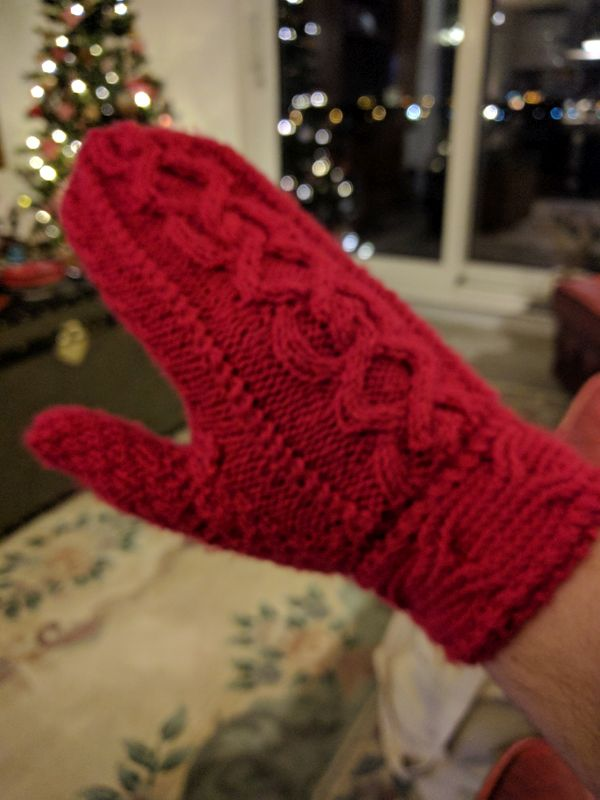




# Instructions

- [ ] Encourage engagement and interaction
- [x] Keep all blog entries as leaf bundles (for example, `hugo new content tech/blog-entry-name` with no .md creates a leaf bundle in the tech section)
- [x] Create a banner image (post-cover.png) in your leaf bundle that is dimensions: 962x520 (1.85:1)
- [x] Still manually add banner image into page content, first thing before anything else using the banner shortcode
- [x] Add any other images you use to the images front matter array (this is purely to help with OpenGraph generation)
- [x] You can use up to two more images in the blog entry, but try not to use any more (unless this is a listicle). Only the banner is essential
- [x] Try to write 1000 words. The closer to this number, the better, but don't go over (75% of the public prefers reading articles under 1,000 words)
- [x] Reading time should not exceed seven minutes
- [x] Make sure to include a description and summary for the blog entry as these are used on the site and in SEO
- [x] Make an appropriate choice of tags in the front matter. These will help in recommending pages to the reader
- [x] Make an appropriate choice of categories in the front matter. The first category will be used in the breadcrumb for the page, others will generate the side menu
- [x] Use Emacs to generate the reading ease and grade level (this should happen automatically when saving the file in my Emacs configuration). These are just for fun, incidentally, and appear to have no impact on audience engagement
- [x] Set the draft to false when you want to publish, then push to GitHub
- [ ] Drop a video announcing this post on Instagram etc, and post anywhere else you can as well. Reels and videos work better for engagement
- [ ] Consider what tomorrow's article will be, and try to post a new one once a day (more is fine)


My local film theatre has an option called 'VIP.' In addition to the improved seating and unlimited snacks, your ticket grants access to a pre-film, all-you-can-eat buffet. After getting my money's worth much quicker than expected, I had a good half hour to spare. I decided to spend the time visiting the water closet in hopes of securing a more settled and comfortable experience once I returned to the cinema hall.

On entering the restroom, I discovered a queue for the stalls. Being British, I immediately joined the queue without a second thought. However, after a few seconds, I realised that there were two stalls, but only one of them was in use. Why were we waiting on this cubicle? What possible terror could have occurred in the other one to be making us act this way?

The thought crossed my mind that, since this was a public mens' toilet in Glasgow, the horror on the other side of that cubicle door could indeed be great. Nonetheless, my spirit of exploration got the better of me and I slowly edged my way to the ostracised unit to see what was going on.

To my shock, it seemed quite pleasant. It was clean and free from odour and there were no surprises waiting in the bowl. I even gave it a quick test flush and everything went as expected.

Feeling rather smug that my intrepid sensibilities had saved me from waiting in the queue, I closed the door and turned the lock... only to discover that the lock was broken. I half opened the door to inspect the lock from a better angle and caught a glimpse of the other men in the queue who each wore satisfied smiles. Clearly I was not the first to have gone through these motions. And, speaking of motions, my need to make a movement was starting to outweigh my willingness to wait in a queue.

In a fit of blatant confidence, I took my trusty Swiss Army Knife from my pocket and began to unscrew the lock housing from the door.

The other men stared at me in disbelief. Not only was this rampant desire to avoid the queue decidedly non-British, it attacked their own decision not to take up arms. I was implicitly elevating myself above them by the mere act of attempting to better my situation beyond the common thinking.

Once I could see inside the lock, it appeared that it had simply been forced to turn further than its logical limit. With the front off, it was easy enough to reset it (though I didn't have the necessary tools to fix the design flaw that allowed it to overturn in the first place). Within a minute, I had the lock reassembled.

As I slowly closed the door, I looked directly into the eyes of my fellow restroommates. Their faces had a look of awe as I disappeared behind the cubicle door and turned the lock. As soon as it met its recess with a satisfying click, I heard at least one of my fellow queuers release a loud laugh of amusement.

I hope you also found this story amusing, but I tell it to illustrate a genuine point. There have been quite a few times in my life that I have been presented with interesting opportunities that I have felt ill-equipped to take on. Sometimes I have let the opportunities pass by, and sometimes I have risen to the challenge. Both decisions have led me to successes and failures, but the important point is that feeling ill-equipped to handle the situation was rarely predictive in whether I was successful.

Having noticed this, I now say yes to a lot more opportunities. I ended up with a PhD, even though I only expected to last a few months. I co-wrote some music that has been listened to over 250,000 times, even though I only expected to sell a few copies. I've worked on music videos for some of my all time favourite musicians, even though I never expected to get past the first tutorial in film making. And now, here I am, writing articles to kindle my much ignored dream of being a writer. Will I succeed? Probably not. But I'm still willing to try, and hopefully learn something along the way.

One thing is for sure: I'm not going to wait for permission, or hope someone shows me how to do it. Most of the good things I've managed in my life have been because I didn't wait for someone to ask me, or show me how. That's not to say I didn't get help along the way, or have a lot of luck on my side. I would never claim that my successes were the result of my effort alone, but it always involved me having to decide I should go for it. Not knowing what you're doing is the first step to knowing what you're doing.

I may add one caveat to this advice, however. If you truly trust or respect someone in the field you are choosing to enter, and they tell you not to bother, well... I'm not saying definitely don't do it. But you may have to do some soul searching to really know what's best.

I am, as yet, unsure of who reads this blog. The messages I have received about it have been quite supportive so far, but have been diverse in why they are enjoying it. None of my readers appear to be the budding writers I'd expected.

However, I hope that this post can be useful to more than just writers. If there is ever something that you wanted to do but felt you had to be asked, just ignore that feeling. Try it anyway. Don't leave it up to other people. You might succeed and you might not, but it's you that'll be in charge of your future.
