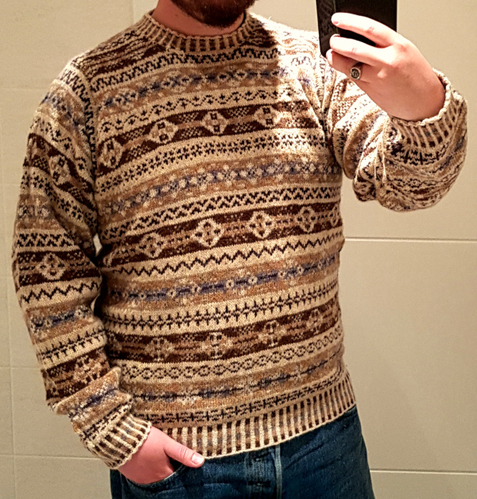
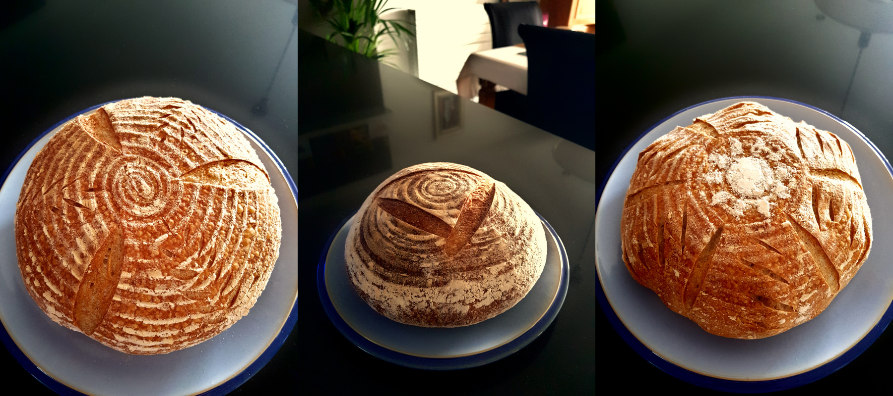




# Instructions

- [ ] Encourage engagement and interaction
- [x] Keep all blog entries as leaf bundles (for example, `hugo new content tech/blog-entry-name` with no .md creates a leaf bundle in the tech section)
- [x] Create a banner image (post-cover.png) in your leaf bundle that is dimensions: 962x520 (1.85:1)
- [x] Still manually add banner image into page content, first thing before anything else using the banner shortcode
- [x] Add any other images you use to the images front matter array (this is purely to help with OpenGraph generation)
- [x] You can use up to two more images in the blog entry, but try not to use any more (unless this is a listicle). Only the banner is essential
- [x] Try to write 1000 words. The closer to this number, the better, but don't go over (75% of the public prefers reading articles under 1,000 words)
- [x] Reading time should not exceed seven minutes
- [x] Make sure to include a description and summary for the blog entry as these are used on the site and in SEO
- [x] Make an appropriate choice of tags in the front matter. The first tag will be used in the breadcrumb for the page, others will generate the side menu
- [x] Use Emacs to generate the reading ease and grade level (this should happen automatically when saving the file in my Emacs configuration). These are just for fun, incidentally, and appear to have no impact on audience engagement
- [x] Set the draft to false when you want to publish, then push to GitHub
- [ ] Drop a video announcing this post on Instagram etc, and post anywhere else you can as well. Reels and videos work better for engagement
- [ ] Consider what tomorrow's article will be, and try to post a new one once a day (more is fine)


It's been a long time since I wrote a blog post, but the strangeness of 2020 compels me. For me, the strangest thing this year has been the COVID-19 lockdown.

It surprised me that people were willing to tank the world economy to protect strangers. It gave me hope. I didn't think we were still capable of things like that. But we knew it made sense: hide ourselves away and starve the virus.

I suppose some were acting out of fear and self-preservation. Others might have only worried about infecting those closest to them. Still, the collective will was impressive. I saw and heard of many small kindnesses during my lockdown here in the UK. For the first time in my life, I felt the whole world uniting under a common goal---even if it came from this awful event.

As time passed, my belief in that notion diminished. People be peopling.

I still believe the world is always getting better, but at a pace that's hard to see through the ebb and flow. Still, I'm sad that society hasn't undergone the fundamental shift I had hoped for.

For posterity, I'm recording what I did during lockdown. It may be of no interest to anyone right now (we all have other things to worry about), but someday it may prove a curiosity to others... especially those who never knew these times.

Lockdown was a relief. At the time, my mere existence was contributing to a global downfall, and the dramatic nature of the lockdown created a feeling of resolve. Here was a plan we could all get behind. But more important for me was the feeling that it wasn't *my* plan. I was now absolved of responsibility in coming up with a course of action for myself. There was freedom in that.

I looked at my suddenly smaller life and decided to embrace it. Staying here was what I had to do, so I made the most of it.

This article isn't intended to be uplifting. I'm not saying things got better because we returned to a slower pace of life. The lockdown was hard and stressful.

I'm also not trying to hold up my life as some ideal. I did what I did, and not because I'm good or bad or better or worse; I did it because I was trying to do the best I could... the same as everyone else.

Not knowing how long the lockdown would last, I made a plan for how to spend my time. There were work duties that would still need done. Although my entire staff was on furlough because there wasn't enough work, I was still in charge of getting money to them, applying for grants, maintaining the building and machinery, keeping the paperwork up to date, and studying government announcements. These tasks filled most of my time. In fact, the first two months of lockdown felt similar to a regular job.

Two months in, at the end of May, I felt sure we would not be returning until at least the end of June. I suppose I was lucky that I didn't have to 'fill my time,' but I wanted my lockdown to be less stressful. I needed a distraction, so I made a short list of things I wanted to do:

- Knit a Fair Isle Jumper
- Spend Time Writing
- Improve My Violin Playing
- Read More Books

I did well with those. I finished knitting my first ever Fair Isle jumper (based on photos from [Ysolda](https://web.archive.org/web/20180917135426/ysolda.com/blogs/journal/a-family-fair-isle)). My sister told me that my violin playing had improved to the point of exceeding the capabilities of my current instrument. I also read nine books in three months (the largest amount of fiction I'd ever read in so short a time). I failed on the writing though. I found it difficult to motivate myself for that.

There were other things too: I learned how to solve a Rubik's cube; clapped for the NHS; fixed things around the house; made calligraphy art; wrote letters; stereotypically started my own sour dough bread; learned how to pick locks; made a facsimile of my parents' high school magazine; and restored a Le Creuset cast iron pan.

I suppose other things were more ordinary, but still unusual for me: I played online games with friends; took better care of myself; watched copious amounts of television; and processed the passing of friends.

With the backdrop of horror going on around us all, it seems important to take stock of what we have and what we don't; and how we can make the most of it. That also means how we can help others. I felt the best way I could help others was by only going out when necessary, and trying to make sure the people I employed would have jobs to come back to. I did my best, and I feel good about that. And it seems important to cling to the good things when there is so much to feel bad about right now.

For me, the first lockdown ended at the start of August 2020. There were still restrictions in place (and more added later, as we faced our second wave), but that was when I started going into work again. So far, that hasn't changed. I suppose, technically, the lockdown doesn't really end until I can hug friends with abandon, and not have to consider the impact of travelling further than five miles from my home. This will be with us for a while. But I feel those first months might be a unique experience in my lifetime, and I hope I did the best I could with them. Only time will tell.
